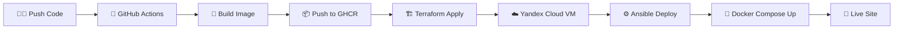

# 🚀 DevOps Portfolio Project
## Современная автоматизация от кода до продакшена

---

## 👋 О проекте

### 🎯 **Что создано**
- **Полноценный DevOps стек** с автоматизацией
- **Многоязычный веб-сайт** (RU/EN) 
- **Комплексный мониторинг** и логирование
- **Автоматические бэкапы** и восстановление
- **CI/CD пайплайн** с GitHub Actions

### 🏆 **Почему это круто**
- ✅ **Production-ready** решение
- ✅ **100% автоматизация** деплоя
- ✅ **Масштабируемая** архитектура
- ✅ **Enterprise-level** мониторинг

---

## 🏗️ Архитектура проекта

### 🎨 **Элегантная схема**

```
👤 Пользователь
    ↓ HTTPS (Let's Encrypt)
🌐 Nginx (Reverse Proxy)
    ↓ Routes
🚀 Flask App (Portfolio)
    ↓
🐳 Docker Ecosystem:
    ├── 📊 Prometheus (Metrics)
    ├── 📈 Grafana (Dashboards)
    ├── 📝 Loki (Logs)
    └── 📋 Promtail (Log Collector)
```

### 🔄 **Поток данных**
1. **Пользователь** → **Nginx** → **Flask App**
2. **Prometheus** собирает метрики со всех сервисов
3. **Grafana** показывает красивые дашборды
4. **Promtail** → **Loki** для централизованных логов

---

## 🛠️ Технологический стек

### ☁️ **Infrastructure as Code**
- **Terraform** - создание VM в Yandex Cloud
- **Ansible** - автоматическая настройка сервера
- **Docker Compose** - оркестрация контейнеров

### 🚀 **CI/CD Pipeline**
- **GitHub Actions** - автоматический деплой
- **GitHub Container Registry** - хранение образов
- **Автоматическое тестирование** и сборка

### 📊 **Observability Stack**
- **Prometheus** - сбор метрик
- **Grafana** - визуализация и дашборды
- **Loki** - агрегация логов
- **Promtail** - сбор логов с контейнеров

### 🔒 **Безопасность**
- **Let's Encrypt** - SSL сертификаты
- **Yandex Cloud Security Groups** - firewall
- **Docker network isolation** - изоляция контейнеров

---

## 🎯 Ключевые особенности

### 🌍 **Многоязычность**
- **Русский** и **Английский** языки
- **Автоматическое определение** языка
- **Переключатель** в интерфейсе
- **Легкое добавление** новых языков

### 📈 **Мониторинг**
- **Real-time метрики** всех сервисов
- **Красивые дашборды** в Grafana
- **Централизованные логи** в Loki
- **Автоматические алерты** (настраиваемые)

### 💾 **Надежность**
- **Автоматические бэкапы** ежедневно
- **Восстановление** из бэкапов
- **Health checks** всех сервисов
- **Graceful shutdown** контейнеров

---

## 🚀 CI/CD Pipeline

### ⚡ **Автоматический деплой**



### 🎯 **Что происходит автоматически**
1. **Push в main** → GitHub Actions запускается
2. **Сборка Docker образа** → публикация в GHCR
3. **Terraform** → создание/обновление инфраструктуры
4. **Ansible** → настройка VM и деплой
5. **Docker Compose** → запуск всех сервисов
6. **Готово!** Сайт обновлен автоматически

---

## 📊 Мониторинг и Observability

### 📈 **Grafana Дашборды**
- **System Overview** - общее состояние системы
- **Docker Containers** - статус всех контейнеров
- **Application Metrics** - метрики Flask приложения
- **Loki Logs** - просмотр логов в реальном времени

### 📝 **Централизованное логирование**
- **Loki** - хранение всех логов
- **Promtail** - сбор логов с контейнеров
- **Grafana** - поиск и анализ логов
- **Structured logging** - структурированные логи

### 🔍 **Метрики**
- **HTTP requests** - количество запросов
- **Response time** - время отклика
- **Active connections** - активные соединения
- **System resources** - CPU, память, диск

---

## 💾 Система бэкапов

### 🔄 **Автоматические бэкапы**
- **Ежедневно в 2:00** - автоматическое создание
- **7 дней хранения** - ротация бэкапов
- **Проверка целостности** - автоматическая валидация
- **Тестирование восстановления** - проверка работоспособности

### 📦 **Что включают бэкапы**
- ✅ **Конфигурации** Docker, Nginx, Prometheus, Grafana
- ✅ **Исходный код** Flask приложения
- ✅ **Данные Grafana** - дашборды и настройки
- ✅ **Логи Loki** - вся история логов
- ✅ **Ansible playbooks** - конфигурации

### 🛠️ **Управление бэкапами**
```bash
# Ручное создание бэкапа
/opt/devops-portfolio/infra/backup/backup.sh

# Восстановление из бэкапа
/opt/devops-portfolio/infra/backup/restore.sh backup-file.tar.gz

# Проверка статуса
/opt/devops-portfolio/infra/backup/backup-status.sh
```

---

## 🌐 Доступные сервисы

### 🏠 **Основные страницы**
- **Главная** - https://your-domain.com/
- **О проекте** - https://your-domain.com/about
- **Мониторинг** - https://your-domain.com/monitoring
- **Архитектура** - https://your-domain.com/architecture

### 📊 **Мониторинг и логи**
- **Grafana** - https://your-domain.com/grafana/
- **Prometheus** - https://your-domain.com/prometheus/
- **Loki** - https://your-domain.com/loki/

### 🔧 **API эндпоинты**
- **Метрики** - `/metrics` (Prometheus format)
- **Системная информация** - `/api/system/disk`
- **Docker контейнеры** - `/api/system/docker`
- **Статистика бэкапов** - `/api/system/backups`

---

## 🎨 Пользовательский интерфейс

### 🌟 **Современный дизайн**
- **Responsive** - адаптивный дизайн
- **Material Design** - современные UI компоненты
- **Smooth animations** - плавные анимации
- **Dark/Light themes** - поддержка тем

### 🌍 **Многоязычность**
- **Автоматическое определение** языка браузера
- **Переключатель языков** в навигации
- **Полная локализация** интерфейса
- **Легкое добавление** новых языков

### 📱 **Мобильная версия**
- **Mobile-first** подход
- **Touch-friendly** интерфейс
- **Быстрая загрузка** на мобильных
- **PWA ready** - готовность к PWA

---

## 🔧 Разработка и DevOps

### 🏠 **Локальная разработка**
```bash
# Быстрый старт
git clone https://github.com/p-aliaksey/portfolio-site.git
cd portfolio-site
docker compose up -d

# Доступ к сервисам
http://localhost/          # Главная страница
http://localhost:3001/     # Grafana
http://localhost:9090/     # Prometheus
```

### 🚀 **Production деплой**
```bash
# Создание инфраструктуры
cd infra/terraform
terraform apply

# Деплой приложения
cd infra/ansible
ansible-playbook -i inventory.ini site.yml
```

### 🧪 **Тестирование**
- **Unit tests** - тесты компонентов
- **Integration tests** - тесты интеграции
- **End-to-end tests** - полные тесты
- **Performance tests** - нагрузочное тестирование

---

## 📈 Результаты и достижения

### 🎯 **Что мы достигли**
- ✅ **100% автоматизация** деплоя
- ✅ **Zero-downtime** обновления
- ✅ **Enterprise-level** мониторинг
- ✅ **Production-ready** решение
- ✅ **Масштабируемая** архитектура

### 📊 **Метрики проекта**
- **6 Docker контейнеров** в production
- **12 технологий** в стеке
- **2 языка** интерфейса
- **4 дашборда** мониторинга
- **7 дней** хранения бэкапов

### 🏆 **Преимущества решения**
- **Быстрый деплой** - от кода до продакшена за минуты
- **Надежность** - автоматические бэкапы и восстановление
- **Масштабируемость** - легко добавить новые сервисы
- **Мониторинг** - полная видимость состояния системы

---

## 🔮 Будущие улучшения

### 🚀 **Планы развития**
- **Kubernetes** - миграция на K8s
- **Helm charts** - управление релизами
- **ArgoCD** - GitOps деплой
- **Istio** - service mesh

### 📊 **Дополнительный мониторинг**
- **Jaeger** - distributed tracing
- **Alertmanager** - уведомления
- **Thanos** - долгосрочное хранение метрик
- **Cortex** - горизонтальное масштабирование

### 🔒 **Безопасность**
- **Vault** - управление секретами
- **Falco** - runtime security
- **OPA** - policy as code
- **Trivy** - сканирование уязвимостей

---

## 🎉 Заключение

### 🌟 **Мы создали**
**Современный, масштабируемый, production-ready DevOps проект** с полной автоматизацией, мониторингом и многоязычной поддержкой.

### 🏆 **Ключевые достижения**
- ✅ **Полная автоматизация** от кода до продакшена
- ✅ **Enterprise-level** мониторинг и логирование
- ✅ **Надежная система** бэкапов и восстановления
- ✅ **Современный UI/UX** с многоязычной поддержкой
- ✅ **Масштабируемая архитектура** для будущего роста

### 🚀 **Готово к production!**

---

## 📞 Контакты

- **GitHub**: https://github.com/p-aliaksey/portfolio-site
- **Email**: pishchik.aliaksey@gmail.com
- **LinkedIn**: Алексей Пищик

---

**© 2025 DevOps Portfolio - Современный DevOps проект с Docker, мониторингом и автоматизацией** 🚀

---

*Создано с ❤️ и современными DevOps практиками*
