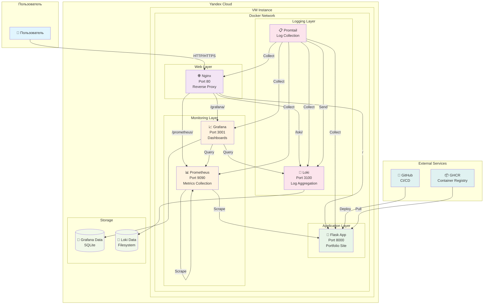

# 🏗️ Архитектура DevOps Portfolio

## Схема инфраструктуры

## Компоненты системы

### 🌐 **Web Layer**
- **Nginx**: Reverse proxy, маршрутизация запросов
- **Порты**: 80 (HTTP), 443 (HTTPS)

### 🚀 **Application Layer**
- **Flask App**: Основное приложение портфолио
- **Порты**: 8000
- **Функции**: Веб-интерфейс, API, метрики

### 📊 **Monitoring Layer**
- **Prometheus**: Сбор метрик
- **Grafana**: Визуализация и дашборды
- **Порты**: 9090 (Prometheus), 3001 (Grafana)

### 📝 **Logging Layer**
- **Loki**: Агрегация логов
- **Promtail**: Сбор логов с контейнеров
- **Порты**: 3100 (Loki)

### 🔄 **CI/CD Pipeline**
- **GitHub Actions**: Автоматическое развертывание
- **GHCR**: Реестр контейнеров
- **Ansible**: Конфигурационное управление
- **Terraform**: Инфраструктура как код

## Потоки данных

1. **Пользовательский трафик**: Nginx → Flask App
2. **Метрики**: Все сервисы → Prometheus → Grafana
3. **Логи**: Все контейнеры → Promtail → Loki → Grafana
4. **Развертывание**: GitHub → Ansible → Docker → Сервисы

## Безопасность

- **Firewall**: Настроен через Yandex Cloud Security Groups
- **HTTPS**: Let's Encrypt сертификаты
- **Изоляция**: Docker контейнеры в отдельной сети
- **Доступ**: SSH ключи для административного доступа
